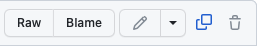

# Bienvenu sur le repo PRG1 de GMB

### Classes
- [PRG1-A](Classe_PRG1-A)
	- [Journal](Classe_PRG1-A/readme.md)
	- [Demos](Classe_PRG1-A/Demos)
	- [MS-Teams](https://teams.microsoft.com/l/team/19%3AVg4ZZljLpAHIENKxjAoGGsJ6M5BcYwmAh-6fQq2XZnY1%40thread.tacv2/conversations?groupId=3e2d9696-6bb1-46b5-a09d-9d02657344b9&tenantId=a372f724-c0b2-4ea0-abfb-0eb8c6f84e40)
- [PRG1-B](Classe_PRG1-B)
	- [Journal](Classe_PRG1-B/readme.md)
	- [Demos](Classe_PRG1-B/Demos)
	- [MS-Teams](https://teams.microsoft.com/l/team/19%3AS_LGxR6ZL5liNmRu0uzYLigVEVvHck7SJcGVwvN0el01%40thread.tacv2/conversations?groupId=dbc7ad6a-61ab-48cb-89c2-a4b0cc828ef6&tenantId=a372f724-c0b2-4ea0-abfb-0eb8c6f84e40)

Tutorat et Appui PRG1
- [Planning](Tutorat_Appui.md)
- [MS-Teams / code : oxjsoz1](https://teams.microsoft.com/l/team/19%3Az6gFcL8IRN2tWBBi3uv-TYLsGOotfwiq2_ApJRoVyMo1%40thread.tacv2/conversations?groupId=0d195aa8-27c2-4a84-99fb-83b7cb2906d7&tenantId=a372f724-c0b2-4ea0-abfb-0eb8c6f84e40)

### Matériel
- [Supports de cours](Slides)
- [Receuil d'exercices](https://github.com/HEIGVD-PRG1/PRG1_Recueil_Exercices)
- [Données laboratoire](Laboratoires)
- [Démos GMB](https://github.com/gmbreguet/PRG1_GMB_DEMO)
- [Compléments](Complements) 
- [Professeurs et assistants](Prof_Assistants.md)
- [Règles de cours PRG1](Complements/regles_PRG1.md)

Comment utiliser ce git

Vous pouvez utiliser ce repo comme suit :

- Visualiser les codes dans votre navigateur avec l'URL

	`https://github.com/2025-PRG1-GMB/COURS`

- Copier/Coller un code en particulier dans votre IDE

	

- Cloner ce git entier avec la commande

	`git clone git@github.com:2025-PRG1-GMB/COURS.git`

- ... puis faire un pull régulièrement

	`git pull <votre répertoire>`

 
Bonne visite 
(C) Guy-Michel Breguet
